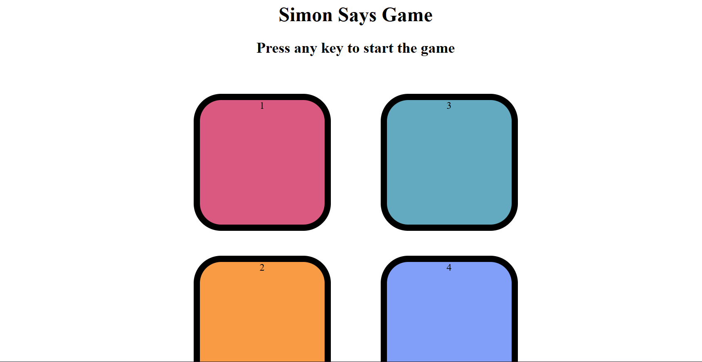

# 🎮 Simon Says Game

A fun and interactive **Simon Says Game** built using **HTML**, **CSS**, and **JavaScript**.  
This mini-project challenges your memory skills — follow the flashing color sequence correctly to advance to the next level!

---

## 🖼️ Preview



---

## 🚀 How to Play

1. Press any key to start the game.
2. Watch the sequence of flashing colors.
3. Repeat the sequence by clicking the buttons in the same order.
4. Each round, the sequence gets longer — test how far you can go!
5. The game ends when you make a mistake.

---

## 🧩 Tech Stack

- **HTML5** — Structure of the game  
- **CSS3** — Styling and animations  
- **JavaScript (Vanilla)** — Game logic and interactivity

---

## 📂 Project Structure

Simon-Says-Game/
│
├── index.html
├── style.css
├── app.js
└── Screenshot_simonsays.png


---

## 💡 Features

- Dynamic color pattern generation  
- Player sequence tracking  
- Level-based progression  
- Simple yet engaging UI

---

## 🏁 How to Run

1. Download or clone the repository  
   ```bash
   git clone https://github.com/Digvej/Simon-Says-Game.git
   ```
2.Open index.html in your browser to start playing!
---
👨‍💻 Author
Digvej
Made with ❤️ using HTML, CSS, and JavaScript.
